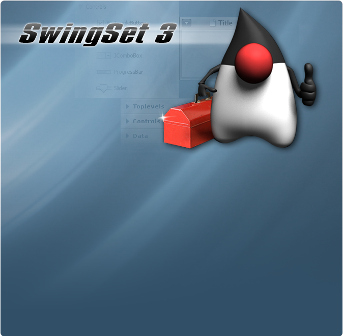

In Summer 2005 [SwingSet2 demo](https://github.com/homebeaver/SwingSet2-demos/releases/tag/1.0.0) has been  released for [J2SE 5.0](https://en.wikipedia.org/wiki/Java_version_history#J2SE_5.0).

original 2005 and updated sun Splash: | SwingSet3 Splash:
------------ | -------------
 | 


This is a rewritten Version of SwingSet2 and SwingSet3 demos. In SwingSet2 there are 16 classes demonstrating 
the abilities of the <a href="https://en.wikipedia.org/wiki/Swing_(Java)">Swing User Interface</a> 
by displaying many of the components in a showcase application. Additionally you can see the important SwingSet3 extensions of the `org.jdesktop.swingx` package.
Use it to try out different components and features.

## TO RUN the demo

- download the [latest jar](https://github.com/homebeaver/SwingSet3-demos/releases/)
- run with new java, i.e. openjdk version "17" 2021-09-14:

```
>java -jar swingset3-demos-1.6.8-jar-with-dependencies.jar

```

The jar was
- Created-By: Apache Maven 3.8.1
- Build-Jdk: 17

## TO MODIFY/BUILD
 
The full source can be found in the "src" subdirectory.

- clone the git repo
- build with maven
- or m2e in eclipse IDE
- there is also an eclipse launcher
